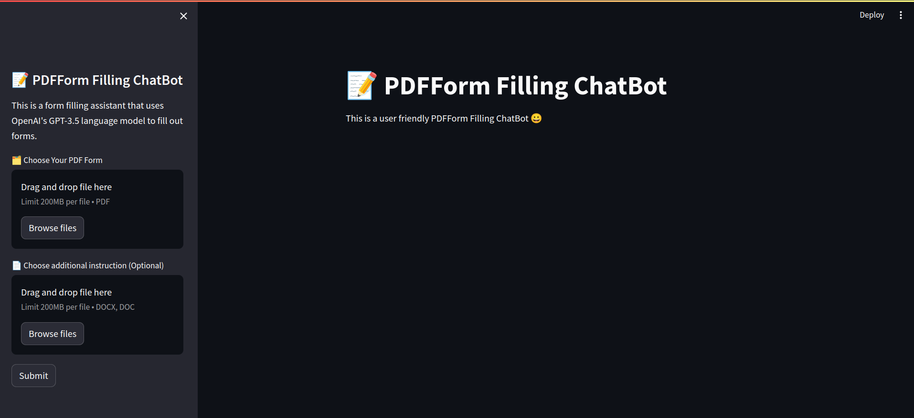

# FormBot

FormBot is designed to automate the process of filling out PDF forms using the Streamlit library and OpenAI's GPT-3. By leveraging the capabilities of these technologies, FormBot ensures efficient and accurate form completion, saving you time and effort.



## Features

- **Streamlit Integration:** Simple and interactive user interface powered by Streamlit.
- **OpenAI GPT-3:** Leverages advanced AI to understand and fill out forms accurately.
- **PDF Handling:** Supports various PDF form formats.
- **User-Friendly:** Easy to set up and use with minimal configuration.

## Installation

To get started with FormBot, follow these steps:

1. **Clone the repository:**
    ```sh
    git clone https://github.com/yourusername/FormBot.git
    ```
2. **Navigate to the project directory:**
    ```sh
    cd FormBot
    ```
3. **Create a virtual environment:**
    ```sh
    python -m venv venv
    ```
4. **Activate the virtual environment:**
    - **Windows:**
        ```sh
        venv\Scripts\activate
        ```
    - **macOS/Linux:**
        ```sh
        source venv/bin/activate
        ```
5. **Set up the OpenAI API key:**
    - Create a free account on the [OpenAI website](https://platform.openai.com/signup).
    - Copy your API key from the OpenAI dashboard.
    - Set the `OPENAI_API_KEY` environment variable:
        - **Windows:**
            ```sh
            set OPENAI_API_KEY=your-api-key
            ```
        - **macOS/Linux:**
            ```sh
            export OPENAI_API_KEY=your-api-key
            ```
6. **Install the required dependencies:**
    ```sh
    pip install -r requirements.txt
    ```

## Usage

1. **Run the Streamlit app:**
    ```sh
    streamlit run app.py
    ```
2. **Upload a PDF form:** 
    - Open your web browser and navigate to the URL provided by Streamlit.
    - Use the upload button to select the PDF form you want to fill out.

3. **Provide the necessary information:**
    - Enter the required information into the form fields presented by the Streamlit interface.

4. **Generate the filled PDF:**
    - Click the submit button to let FormBot process the data and fill the PDF form.
    - Download the completed PDF form from the provided link.

## Contributing

If you have suggestions for improvements or want to add new features, feel free to create a pull request or open an issue.

1. **Fork the repository**
2. **Create a new branch:**
    ```sh
    git checkout -b feature-branch
    ```
3. **Make your changes and commit them:**
    ```sh
    git commit -m 'Add some feature'
    ```
4. **Push to the branch:**
    ```sh
    git push origin feature-branch
    ```
5. **Create a pull request**

## Acknowledgements

- [Streamlit](https://www.streamlit.io/)
- [OpenAI](https://www.openai.com/)
